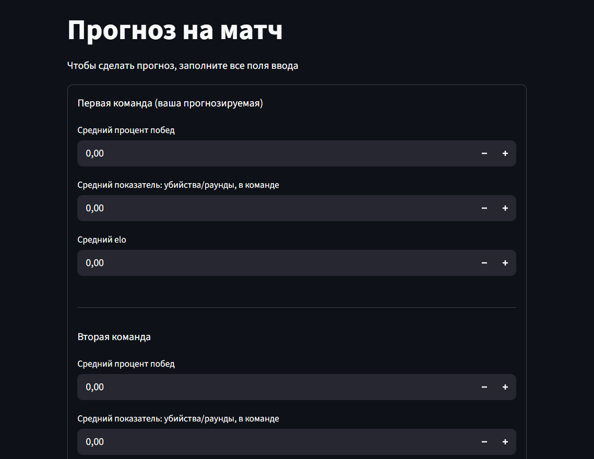
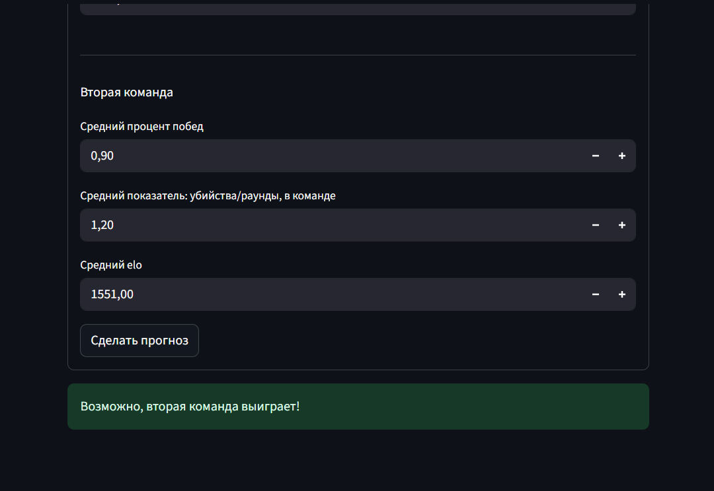

# CS2 Faceit Match Winner Prediction
Полноценная система для предсказания победителей в CS2 матчах (Faceat) с REST API и веб-интерфейсом.

## 🎯 О проекте
Проект предсказывает вероятность победы команды на основе:
- Среднего K/D ratio команд
- Среднего Elo рейтинга  
- Среднего процента побед

## 🌟 Возможности
- **REST API** на FastAPI
- **Веб-интерфейс** на Streamlit
- **Логистическая регрессия** для предсказания побед

## 📊 Данные
Датасет был взят со следующего источника:
[Counter Strike 2 Win Prediction (FACEIT)](https://www.kaggle.com/datasets/piercehentosh/counter-strike-2-win-prediction-faceit)  
Обрабатывал данные через библиотеку **pandas**.  
Что было сделано:
- Замена запятой на точку в некоторых числовых колонках (т.к pandas ожидает в float числах точку)
- Убрал объекты, в которых значение в колонке *map* не подходило для рейтинговых faceat игр (например: aim_map, awp_india, dorf...) 
- Использовал standard scaler для нормализации данных

## ⚙️ Метрики
Тестировал как линейные модели, так и ансамбли. Но в итоге выбрал **логистическую регрессию** за хорошие результаты и интерпретируемость.  
Главной метрикой стала precision, т.к нам нужно быть уверенным в победе первой команды, а не "найти" все победы первой команды как с recall.
ML модель достигает:
- *Precision*: 0.91
- *Recall*: 0.43
- *F1-Score*: 0.58
- *Accuracy*: 0.71

## 🖼️ Демонстрация 
<div align="center">

| Главный экран | Прогноз |
|---------------|--------------|
|  |  |  

</div>

## 🏗️ Структура проекта
```text
Cs2_predict/
├── api/                               # FastAPI микросервис
│   ├── data.py                        # класс данных для FastAPI приложения
│   └── service.py                     # FastAPI приложение
├── app/                               # Streamlit фронтенд
│   └── app.py                         # Основное приложение
├── configs/                    
|   └── model_v1.yaml                  # Конфигурационный файл с параметрами модели и путем до нее
├── images/ 
├── ml_core/                           # Ядро ML
│   ├── constants/                     # Константные значения
│   │   └── constants.py  
│   ├── src/                           # Модули для озагрузки датасета и обучения модели
│   │   ├── dataset/
│   │   │   └── make_dataset.py        # Загрузка датасета из файла и преобразование данных из него
│   │   ├── model/
│   │   │   ├── evaluate.py            # Проверка качества модели
│   │   │   ├── loader.py              # Модуль для загрузки модели и скейлера
│   │   │   ├── predict.py             # Модуль для предсказаний модели
│   │   │   └── train_model.py         # Модуль обучения модели
│   │   └── utils/
│   │       ├── exceptions.py          # Исключения для отладки кода
│   │       └── time.py                # Модуль работы с временем 
│   └── tests/                         # Тесты
│       └── unit_tests/                
│           ├── test_dataset.py 
|           ├── test_params_loader.py  
│           └── test_loader.py       
├── notebooks/                         # Код в jupiter notebook (файл с EDA и файл с обучением модели)
│   ├── 1.EDA.ipynb
│   ├── 2.ML.ipynb
│   └── Neural Network testing.ipynb
├── scaler/                            # .pkl файлы со скейлерами (StandardScaler)
├── trained_models/                    # .pkl файлы с обученной моделью
├── train.py                           # Обучение модели
├── Dockerfile                         # Файл для докер образа
├── pytest.ini
└── README.md
```

## Локальный запуск
```bash
# API сервер
uvicorn api.service:app --reload --port 8000

# Frontend
streamlit run app/app.py
```
Запуск Api сервера через docker:
```bash
# Создание докер образа
docker build -t cs2-ml-api .

# Запуск контейнера
docker run -p 8000:8000 cs2-ml-api
```

## 🖥️ Веб-интерфейс
Streamlit приложение доступно по адресу: http://localhost:8501


